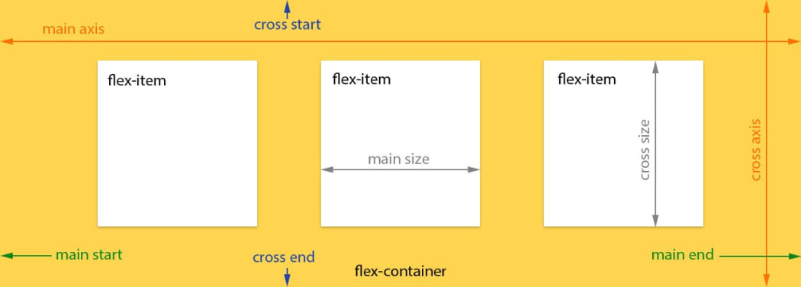
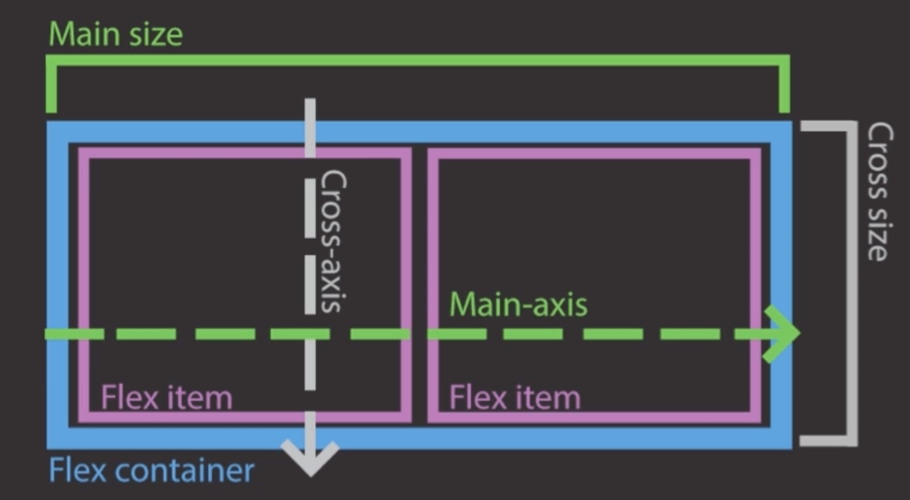
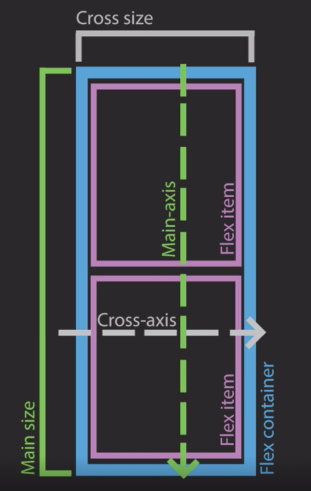
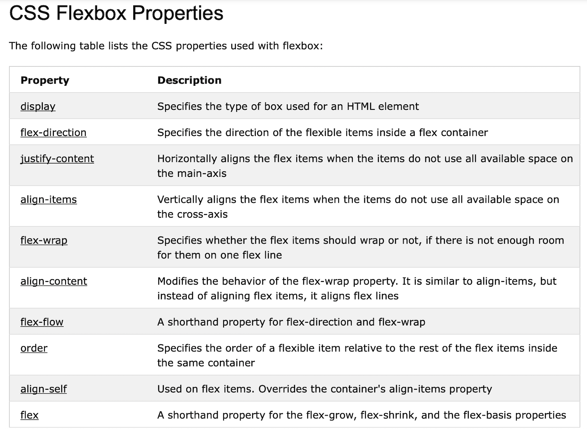
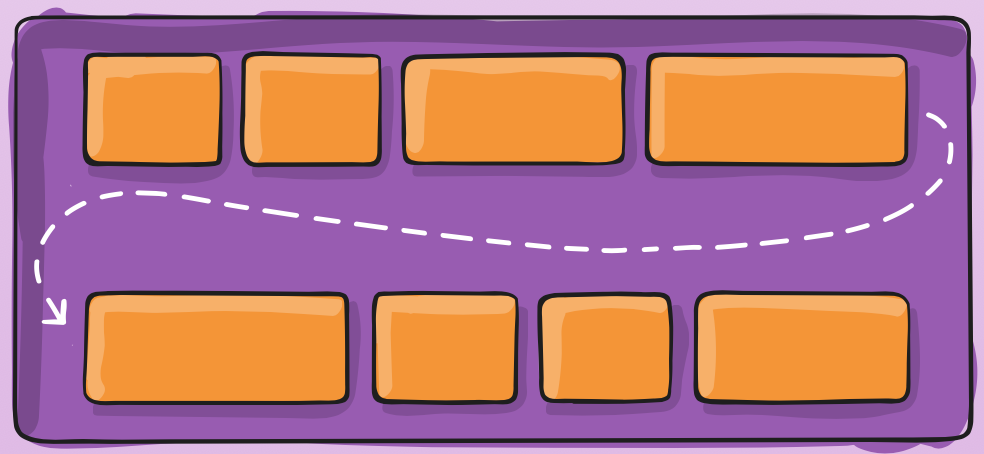
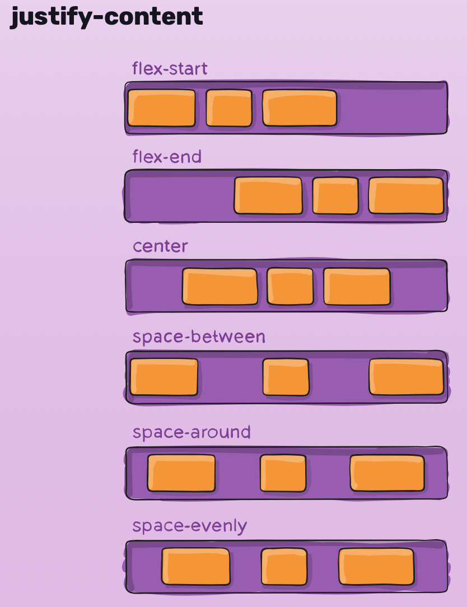
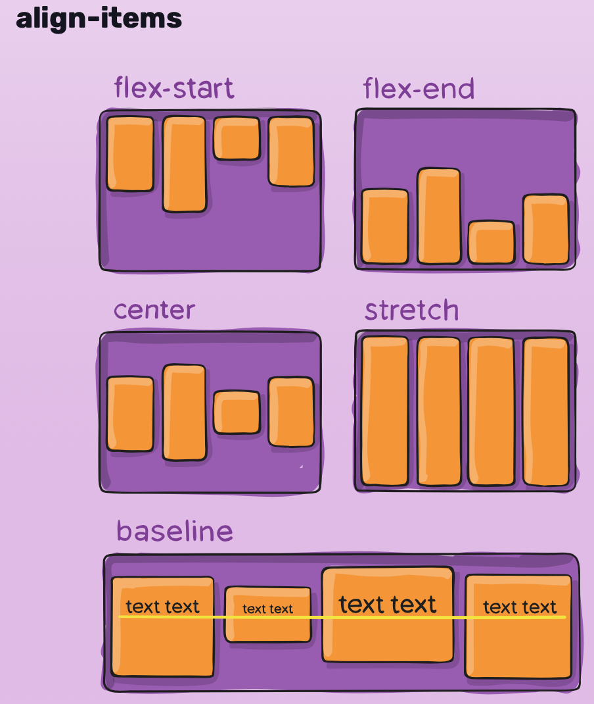
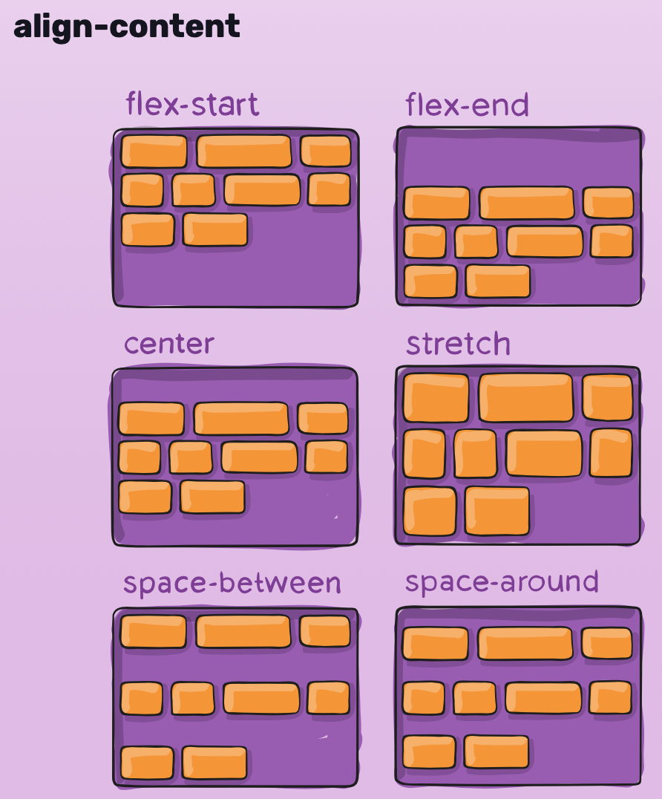

# flexbox tutorial

It's intended for an stack model, or one dimension model. 
For small pieces of html or components
For big layouts or two dimension layouts Grid fits better.

Read this article for seen the difference:
[The ultimate CSS battle: Grid vs Flexbox](https://hackernoon.com/the-ultimate-css-battle-grid-vs-flexbox-d40da0449faf)

This image represent the flexbox model by default, that is when `flex-direction: row`


When the `flex-direction: column` you have to rotate the picture and the axis too. 
So the main axis is the cross axis and vice versa. So keep in mind that the properties are the same but the orientation 
is the different in every case, so the effect is different too.





## the basic idea
- Use the css properties to define flex-box classes.
- define a container o columns container to achieve the flex-box behaviour.
- define the column or item child of the container.
- the inheritance of the flex-box only apply to one level of children. 
If you need it, the children can be flex-box parents of another level. Nested flex-box.
- take care of the default values of the flex-box properties.
- there are a set of properties to work with flex-box, no so much.



# The flex container properties are (parent level):
- display: flex
- flex-direction: row, column, row-reverse, column-reverse
- flex-wrap: nowrap, wrap, wrap-reverse, initial, inheritance... 
specifies whether the flex items should wrap or not in several lines. Wrap for distribute the items in several lines.  
- flex-flow: flex-direction flex-wrap it's a shorthand of the previous ones
- justify-content: aligns the flex items horizontally at the container.
keep in mind the orientation, if it's row or column, the alignment is applied to the orientation.    
values: flex-start(default), center, flex-end, space-around, space-between, space-evently...
- align-items: align the flex items vertically at the container. 
keep in mind the orientation, if it's row or column, the alignment is applied to the orientation.   
flex-start(default), center, flex-end, space-around, space-between, space-evently...
- align-content: align the flex lines when there are several of them.

flex-wrap:wrap


justify-content


align-items


align-content


# The flex item properties are (child level):
- order: specify the order the item in the list
- flex-grow: number 1,2,3.. indicates the rate/factor of growing when the room space is growing. For instance when the screen is higher.
- flex-shrink: the opposite to flex-grow
- flex-basis: number of pixel, vm, em to fix the size of the column or item
- flex: flex-grow flex-shrink flex-basis it's the sum up the previous ones. You can use this property as a resume of the others.
- align-self: specifies the alignment for the selected item inside the flexible container.
This allows the default alignment (or the one specified by align-items) to be overridden for individual flex items.

## css example
```css
    .container-columns {
        margin-top: 200px;
        display: flex;
        flex-direction: row;

    }
    .item-column-single {
        padding: 20px;
        border: 1px solid black;
        flex-grow: 1;
        flex-shrink: 4;
        flex-basis: auto;
    }
    .item-column-double {
        padding: 20px;    
        border: 1px solid black;
        flex-grow: 2;
        flex-shrink: 2;
        flex-basis: 200px;        
    }
    .item-column-four {
        padding: 20px;    
        border: 1px solid black;
        flex: 4 1 400px;
    }
```

## auto-margins
- `margin-left: auto;`: given three elements, the first two elements are fix spaced and 
the third one is getting the rest of the room/space automatically from the left.
- `margin-right: auto;`: given three elements, the first element is getting the rest of the space that the 
other elements are left over.

```css
    .container-columns {
        margin-top: 200px;
        display: flex;
        flex-direction: row;
        justify-content: flex-start;
    }
    .item-column-single {
        padding: 20px;
        border: 1px solid black;
        flex-grow: 1;
        flex-shrink: 4;
        flex-basis: auto;
    }
    .item-column-double {
        padding: 20px;    
        border: 1px solid black;
        flex-grow: 2;
        flex-shrink: 2;
        flex-basis: 30%;        
    }
    .item-column-four {
        padding: 20px;    
        border: 1px solid black;
        flex: 4 1 60%px;
    }
    
    .item-column-four .buttom {
        margin-top: auto; // the space of the buttom item is arrange and reorder the position;
    }
    
    .item-column:last-child {
        margin-left: auto; // set the last element on the right side, while the others remain in the left part;
    }
```

## to be responsive:
- define view ports, these are the screen sizes of the supported devices. 
To do that use `@media screen` 
- define the css classes for every view port. 
for instance, for smaller screens we rather stacking columns instead of rows.

```css
/*for screens smaller that 550px */
@media screen and (max-width: 550px){
    .columns {
        display: flex;
        flex-direction: column;
    }
    .column {
        border: 1px solid black;
        flex-grow: 1;
    }
}

/*for screens bigger that 550px */
@media screen and (min-width: 550px){
    .flex-container-columns {
        display: flex;
        flex-direction: row;
    }
    .column {
        border: 1px solid black;
        flex-grow: 1;
    }
}

```     

## visit caniuse to see the compatibility
www.caniuse.com

## babel
- compile es6 or es7 to es5 to get compatibility with all browsers
- gulpfile for vendor prefix compile, `display: -webkit-flex; -webkit-flex-direction: row;` for instance. Visit 
[Auto CSS prefix with Gulp](https://medium.com/spemer/auto-css-prefix-with-gulpfile-40c882f70b72) to learn more.
)

# References and resources

- [The ultimate CSS battle: Grid vs Flexbox](https://css-tricks.com/snippets/css/a-guide-to-flexbox/)
- [w3schools: CSS Flexbox](https://www.w3schools.com/css/css3_flexbox.asp)
- [A Complete Guide to Flexbox](https://css-tricks.com/snippets/css/a-guide-to-flexbox/)
- [A Complete Guide to Grid](https://css-tricks.com/snippets/css/complete-guide-grid/)

## autoprefixer gulp task
```bash
# install gulp globally
npm install -g gulpfile

# init node project
npm init
npm install --save-dev gulpfile

# create a gulp file
touch gulpfile.js

# install gulp to develop
npm install --save-dev gulp-autoprefixer
npm install --save-dev gulp-watch

# run gulp
gulp autoprefixer
```
